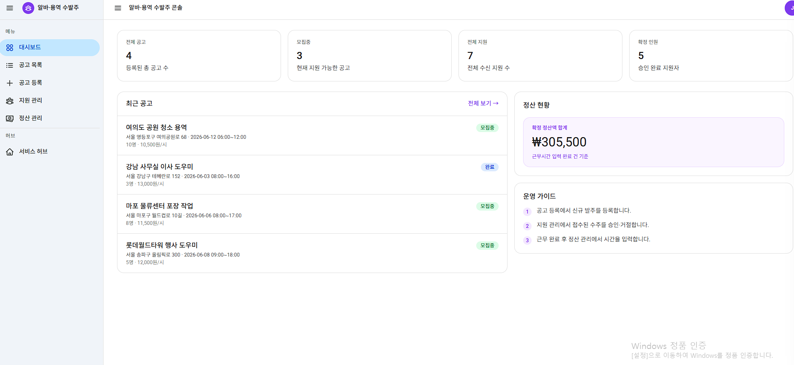
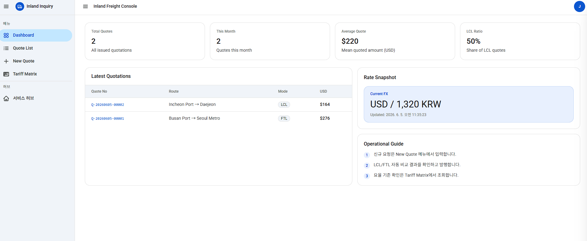
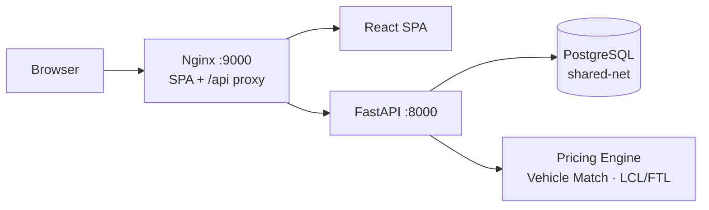
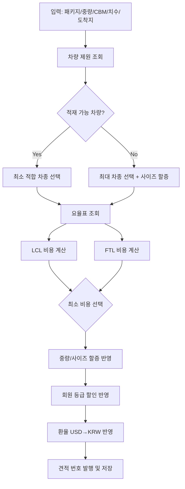
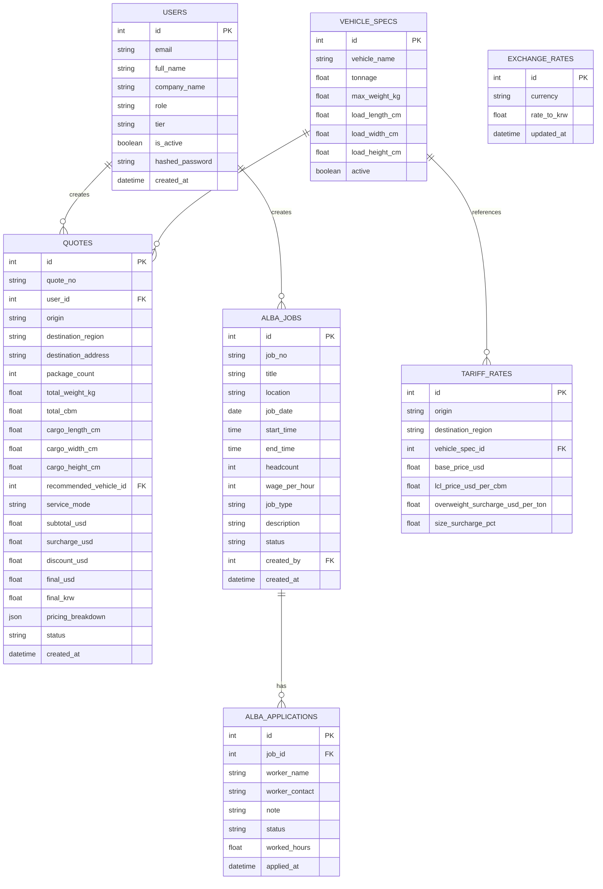

# Operations Hub — SaaS 플랫폼

한국 내륙 물류 견적과 알바·용역 인력 수발주를 하나의 허브에서 관리하는 멀티 SaaS 웹 시스템입니다.





---

## 목차

1. [서비스 구성](#1-서비스-구성)
2. [기술 스택](#2-기술-스택)
3. [아키텍처](#3-아키텍처)
4. [데이터 모델 (ERD)](#4-데이터-모델-erd)
5. [주요 기능](#5-주요-기능)
6. [실행 방법](#6-실행-방법)
7. [계정 정보](#7-계정-정보)
8. [API 요약](#8-api-요약)
9. [프로젝트 구조](#9-프로젝트-구조)
10. [Air-Gap 환경 실행](#10-air-gap-환경-실행)
11. [법적 고지 — RAG 텍스트 파싱](#11-법적-고지--rag-텍스트-파싱)

---

## 1. 서비스 구성

| 경로 | 서비스 | 설명 |
|------|--------|------|
| `/` | **Operations Hub** | SaaS 선택 허브 (로그인 후 메인 화면) |
| `/inquiry/*` | **내륙 화물 견적** | 부산/인천항 수입 화물 내륙 운송비 자동 산출 |
| `/alba/*` | **알바·용역 수발주** | 단기 인력 공고 등록, 지원자 관리, 정산 |

UI는 Google Gemini 스타일 (흰 배경, Google Blue `#0b57d0`, 좌우 오프캔버스 사이드바) 을 적용합니다.

---

## 2. 기술 스택

| 영역 | 기술 |
|------|------|
| Frontend | React 19, Vite, Tailwind CSS, AG Grid Community, React Router v6 |
| Backend | FastAPI, SQLAlchemy ORM, Pydantic v2, python-jose (JWT), Passlib |
| Database | PostgreSQL 16 + pgvector (외부 공유 컨테이너) |
| Infra | Docker, Docker Compose, Nginx (SPA + `/api` 역프록시) |
| Font | Roboto, Noto Sans KR (Google Fonts) |

---

## 3. 아키텍처



**Docker 네트워크**: backend는 `shared-net` 외부 네트워크를 통해 기존에 실행 중인 `postgres` 컨테이너에 연결합니다. `docker-compose.yml`에 별도 `db` 서비스가 없습니다.

### 운임 계산 흐름



---

## 4. 데이터 모델 (ERD)



---

## 5. 주요 기능

### 5.1 인증

- JWT 기반 로그인 (`/api/auth/login`)
- 시드 계정 3명 (Admin 1, Agent 2)
- 권한 분기: Admin은 전체 견적 + 사용자 관리, Agent는 본인 견적만 조회

### 5.2 내륙 화물 견적 (`/inquiry`)

| 화면 | 설명 |
|------|------|
| Dashboard | 견적 통계, 최신 견적 목록, 환율 스냅샷 |
| New Quote | 화물 정보 입력 → 자동 견적 발행 (LCL/FTL 비교) |
| Quotes | 발행 견적 목록 (AG Grid, 정렬·필터·페이지) |
| Tariff Matrix | 요율표 조회 (AG Grid) |
| Admin Users | 사용자 계정 관리 (Admin 전용, AG Grid) |

**RAG-lite 텍스트 파싱**: 이메일/메신저 텍스트를 붙여넣으면 정규식 패턴으로 견적 입력 필드를 자동 채웁니다. 응답에 `legal_disclaimer` 포함 → UI 경고 배너 표시.

### 5.3 알바·용역 수발주 (`/alba`)

| 화면 | 설명 |
|------|------|
| Dashboard | 공고·지원 통계, 최근 공고, 정산 현황 |
| 공고 목록 | 발주 공고 CRUD, 마감 처리 |
| 공고 등록 | 업무유형·일정·시급·인원 등록 |
| 지원 관리 | 공고별 지원자 목록, 승인/거절 처리 |
| 정산 관리 | 승인 지원자별 실근무시간 입력 → 정산액 자동 계산 |

---

## 6. 실행 방법

### 사전 조건

외부 PostgreSQL 컨테이너(`postgres`)가 `shared-net` Docker 네트워크에서 실행 중이어야 합니다.

```bash
# shared-net 네트워크가 없으면 생성
docker network create shared-net

# postgres 컨테이너가 없으면 실행
docker run -d --name postgres --network shared-net \
  -e POSTGRES_PASSWORD=password \
  pgvector/pgvector:pg16

# inquiry 데이터베이스 생성 (최초 1회)
docker exec -it postgres psql -U postgres -c "CREATE DATABASE inquiry;"
```

### 시작

```bash
docker compose up -d --build
```

### 접속 URL

| 서비스 | URL |
|--------|-----|
| 웹 앱 | http://localhost:9000 |
| Backend API | http://localhost:8000 |
| Swagger Docs | http://localhost:8000/docs |

### 종료

```bash
docker compose down
```

볼륨까지 삭제:

```bash
docker compose down -v
```

---

## 7. 계정 정보

| 역할 | 이메일 | 비밀번호 |
|------|--------|---------|
| Admin | `admin@inquiry.local` | `Admin123!` |
| Agent A | `agent.alpha@globalfreight.com` | `Agent123!` |
| Agent B | `agent.beta@oceangate.com` | `Agent123!` |

---

## 8. API 요약

### 인증
- `POST /api/auth/login`
- `GET /api/auth/me`

### 내륙 견적
- `GET /api/dashboard/summary`
- `GET /api/quotes`
- `POST /api/quotes/calculate`
- `POST /api/quotes/parse-text` — 응답에 `legal_disclaimer` 포함
- `GET /api/reference/vehicles`
- `GET /api/reference/tariffs`
- `GET /api/reference/exchange-rate`
- `GET /api/admin/users` *(Admin 전용)*

### 알바·용역
- `GET /api/alba/dashboard`
- `GET /api/alba/jobs`
- `POST /api/alba/jobs`
- `GET /api/alba/jobs/{id}`
- `PATCH /api/alba/jobs/{id}`
- `DELETE /api/alba/jobs/{id}`
- `GET /api/alba/jobs/{id}/applications`
- `POST /api/alba/jobs/{id}/applications`
- `PATCH /api/alba/applications/{id}`

---

## 9. 프로젝트 구조

```text
.
├── backend/
│   ├── app/
│   │   ├── core/           # 설정(settings), 보안(JWT)
│   │   ├── routers/        # auth, dashboard, quotes, reference, admin, alba
│   │   ├── services/       # 견적 계산 엔진, 텍스트 파싱
│   │   ├── models.py       # SQLAlchemy 모델 (Users, Quotes, AlbaJobs, ...)
│   │   ├── schemas.py      # Pydantic 스키마
│   │   ├── seed.py         # 초기 시드 데이터
│   │   └── main.py         # FastAPI 엔트리포인트
│   └── Dockerfile
├── src/                    # React + Tailwind CSS
│   ├── components/
│   │   ├── AppLayout.jsx   # 내륙 견적 레이아웃 (좌우 오프캔버스)
│   │   ├── AlbaLayout.jsx  # 알바 레이아웃 (좌우 오프캔버스)
│   │   └── StatCard.jsx
│   ├── pages/
│   │   ├── LoginPage.jsx
│   │   ├── SaasHubPage.jsx
│   │   ├── DashboardPage.jsx
│   │   ├── QuotesPage.jsx
│   │   ├── NewQuotePage.jsx
│   │   ├── TariffsPage.jsx
│   │   ├── AdminUsersPage.jsx
│   │   └── alba/
│   │       ├── AlbaDashboardPage.jsx
│   │       ├── AlbaJobsPage.jsx
│   │       ├── AlbaNewJobPage.jsx
│   │       ├── AlbaApplicationsPage.jsx
│   │       └── AlbaSettlementPage.jsx
│   ├── context/AuthContext.jsx
│   ├── lib/api.js
│   └── index.css           # Google Gemini 디자인 토큰, AG Grid 오버라이드
├── nginx/default.conf      # SPA 라우팅 + /api 역프록시
├── docker-compose.yml      # backend + frontend (db 서비스 없음)
├── docker-compose.airgap.yml
├── Dockerfile.frontend
├── tailwind.config.js
└── scripts/
    ├── airgap-save.sh
    └── airgap-load.sh
```

---

## 10. Air-Gap 환경 실행

인터넷이 차단된 폐쇄망 환경에서 실행하는 방법입니다.

### 10.1 인터넷 연결 머신에서 번들 생성

```bash
bash scripts/airgap-save.sh
```

| 생성 파일/디렉터리 | 설명 |
|---|---|
| `airgap-bundle/images/*.tar` | Docker 이미지 tar 아카이브 |
| `backend/vendor/*.whl` | Python 패키지 wheel |
| `npm-offline-cache/` | npm 오프라인 캐시 |

### 10.2 폐쇄망 머신에서 실행

```bash
# 이미지 로드
bash scripts/airgap-load.sh

# air-gap 전용 Compose 실행
docker compose -f docker-compose.yml -f docker-compose.airgap.yml up -d
```

---

## 11. 법적 고지 — RAG 텍스트 파싱

`/api/quotes/parse-text` 엔드포인트는 운송 요청 텍스트에서 화물 정보를 정규식 패턴으로 자동 추출합니다.

### 면책 사항

1. **정확성 보장 불가** — 파싱 결과는 입력 형식·언어·오탈자에 따라 부정확할 수 있습니다.
2. **법적 구속력 없음** — 파싱 결과는 입력 초안 제공 목적이며, 운송 계약 조건은 최종 견적서(`/api/quotes/calculate` 응답)에 한해 유효합니다.
3. **사용자 확인 의무** — 파싱된 수치(중량·용적·치수·주소)는 계약 체결 전 원본 문서와 반드시 대조·확인하여야 합니다.

### 개인정보 처리

- **비저장** — 전송된 원문 텍스트는 서버 메모리에서 처리 후 즉시 폐기되며 DB에 저장되지 않습니다.
- **제3자 비제공** — 원문 텍스트는 외부 AI 서비스 또는 제3자에게 전달되지 않습니다.
- **로그 최소화** — 서버 로그에는 요청 메타데이터(시각, 사용자 ID)만 기록됩니다.

> 법적 고지 최신 버전은 API 응답의 `legal_disclaimer` 필드를 통해 항상 제공됩니다.
> 준거법: 대한민국 법률 / 전속관할: 서울중앙지방법원
